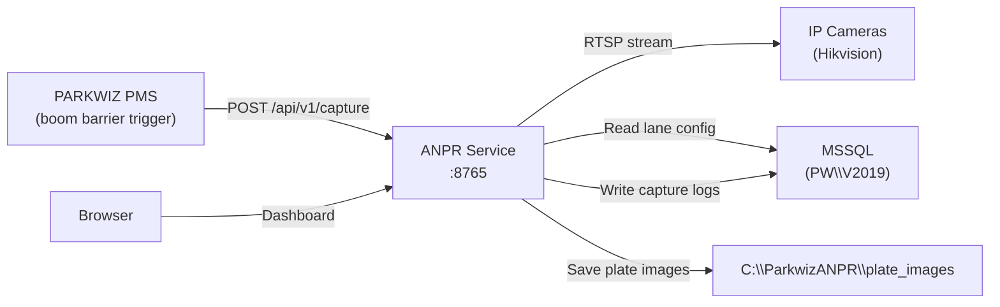

# PARKWIZ ANPR Service — Production Server Deployment Guide

> **Target**: Windows Server 2022 / Windows 10 Pro, on-premise local network

---

## Architecture Overview



---

## Pre-Requisites Checklist

Before you start, confirm these are installed on the **server**:

| Requirement | Check Command | Download |
|---|---|---|
| Python 3.10+ | `python --version` | [python.org](https://python.org) |
| Git | `git --version` | [git-scm.com](https://git-scm.com) |
| Git LFS | `git lfs version` | [git-lfs.com](https://git-lfs.com) |
| ODBC Driver 17 | Check Programs & Features | [Microsoft Download](https://learn.microsoft.com/en-us/sql/connect/odbc/download-odbc-driver-for-sql-server) |
| SQL Server instance | `sqlcmd -S PW\V2019 -Q "SELECT 1"` | Already installed |
| NSSM | Place `nssm.exe` in `C:\ParkwizANPR\` | [nssm.cc/download](https://nssm.cc/download) |

> [!IMPORTANT]
> The ODBC Driver 17 for SQL Server is **mandatory**. Without it, the service cannot connect to the database.

---

## Step 1 — Create the Deployment Directory

```powershell
mkdir C:\ParkwizANPR
cd C:\ParkwizANPR
```

All application files, logs, images, and config will live here.

---

## Step 2 — Clone the Repository

```powershell
git lfs install
git clone https://github.com/superv2003/PW-ANPR.git .
```

> [!NOTE]
> The `.` at the end clones directly into `C:\ParkwizANPR` (not into a subfolder).
> Git LFS will automatically download the 12MB ONNX model file.

After cloning, verify:
```powershell
dir lpr_engine\models\indian_plate_detector.onnx
# Should show ~12MB file
```

---

## Step 3 — Create Python Virtual Environment

```powershell
python -m venv venv
.\venv\Scripts\Activate.ps1
```

You should now see `(venv)` in your prompt.

---

## Step 4 — Install Python Dependencies

```powershell
pip install --upgrade pip
pip install -r requirements.txt
```

This installs FastAPI, Uvicorn, pyodbc, PaddleOCR, ONNX Runtime, OpenCV, and all other dependencies. Takes ~3-5 minutes on a fresh install.

Verify:
```powershell
python -c "import fastapi; import pyodbc; import paddleocr; print('All OK')"
```

---

## Step 5 — Configure the Service

```powershell
copy config.ini.example config.ini
notepad config.ini
```

Edit these sections for **your server**:

### `[database]` — Match your SQL Server instance
```ini
[database]
server = PW\V2019          ; ← Your SQL Server instance name
database = PARKWIZ         ; ← Your database name
username = sa
password = pwiz            ; ← Your sa password
driver = ODBC Driver 17 for SQL Server
pool_size = 5
```

### `[camera]` — Your Hikvision camera credentials
```ini
[camera]
rtsp_username = admin
rtsp_password = Parkwiz@2022    ; ← Camera password
rtsp_port = 554
rtsp_path = /Streaming/Channels/101
```

### `[storage]` — Where plate images and logs are saved
```ini
[storage]
image_dir = C:\ParkwizANPR\plate_images
log_dir = C:\ParkwizANPR\logs
retention_days = 30             ; ← Images older than this are auto-deleted
```

### `[service]` — API key (optional)
```ini
[service]
api_key =                       ; ← Leave empty for no auth (local network)
; api_key = my-secret-key-123   ; ← Set this to require X-API-Key header
```

### `[polling]` — Shadow Testing
If you are deploying for testing without modifying PMS code:
```ini
[polling]
enabled = yes                   ; ← 'yes' to test automatically via database
lanes = 26,27                   ; ← Comma-separated list of lanes to test
interval_ms = 1000
```

> [!CAUTION]
> **Never commit `config.ini`** to Git — it contains real passwords. Only `config.ini.example` is tracked.

---

## Step 6 — Prepare the Database

### 6a. Create the Capture Log Table
```powershell
sqlcmd -S PW\V2019 -d PARKWIZ -U sa -P pwiz -i scripts\create_capture_log.sql
```

Expected output:
```
Table tblANPRCaptureLog created successfully.
Index IX_ANPRLog_Lane created.
Index IX_ANPRLog_Plate created.
ANPR Capture Log setup complete.
```

### 6b. Verify Lane Configuration Table
The `tblLaneANPRConfiguration` table must already exist (created by PMS). Verify your lanes:
```powershell
sqlcmd -S PW\V2019 -d PARKWIZ -U sa -P pwiz -Q "SELECT PMSLaneNumber, ANPRAPIURL, flgEnableANPR, ActiveStatus FROM tblLaneANPRConfiguration"
```

Each lane needs:
- `PMSLaneNumber` — e.g., `26`
- `ANPRAPIURL` — Camera IP, e.g., `192.168.1.64`
- `flgEnableANPR` — `1` (enabled)
- `ActiveStatus` — `Y`

---

## Step 7 — Smoke Test (Manual Run)

Before installing as a service, test it manually:

```powershell
cd C:\ParkwizANPR
.\venv\Scripts\Activate.ps1
python -m parkwiz_anpr.main
```

You should see:
```
PARKWIZ ANPR Service v1.0.0 starting
Host: 0.0.0.0:8765
Database connected ✅
Lane config cache loaded: X lane(s)
LPR Pipeline models pre-loaded ✅
PW-ANPR Service ready ✅
Uvicorn running on http://0.0.0.0:8765
```

### Verify endpoints:

| Test | URL/Command |
|------|-------------|
| Dashboard | Open browser → `http://SERVER_IP:8765/dashboard` |
| Health | `http://SERVER_IP:8765/api/v1/health` |
| API Docs | `http://SERVER_IP:8765/docs` |
| Manual Capture | Click **⚡ Trigger Capture** on dashboard |

Stop it with `Ctrl+C` once you've confirmed everything works.

---

## Step 8 — Install as Windows Service (NSSM)

### 8a. Download NSSM
Download from [nssm.cc/download](https://nssm.cc/download), extract, and copy `nssm.exe` to `C:\ParkwizANPR\nssm.exe`.

### 8b. Run the installer (as Administrator)
```powershell
# Right-click PowerShell → Run as Administrator
cd C:\ParkwizANPR
.\install_service.bat
```

This will:
- Register `ParkwizANPR` as a Windows Service
- Set it to **auto-start** on boot
- Configure log rotation (10MB per file, rotated)
- Start the service immediately

### 8c. Verify the service is running
```powershell
Get-Service ParkwizANPR
# Status should be: Running
```

---

## Step 9 — Firewall Rule

Allow port 8765 so the PMS servers and your browser can reach it:

```powershell
# Run as Administrator
New-NetFirewallRule -DisplayName "ParkWiz ANPR Service" -Direction Inbound -Port 8765 -Protocol TCP -Action Allow
```

---

## Step 10 — Verify from Another Machine

From any machine on your local network:
```
http://SERVER_IP:8765/dashboard
http://SERVER_IP:8765/api/v1/health
```

---

## Service Management Commands

| Action | Command |
|--------|---------|
| Check status | `Get-Service ParkwizANPR` |
| Stop service | `Stop-Service ParkwizANPR` |
| Start service | `Start-Service ParkwizANPR` |
| Restart service | `Restart-Service ParkwizANPR` |
| View logs | `Get-Content C:\ParkwizANPR\logs\anpr_service.log -Tail 50` |
| View errors only | `Get-Content C:\ParkwizANPR\logs\anpr_errors.log -Tail 50` |
| Uninstall service | Run `uninstall_service.bat` as Admin |

---

## File Structure on Server

```
C:\ParkwizANPR\
├── config.ini                    ← Your site-specific config (NOT in Git)
├── nssm.exe                      ← Windows Service manager
├── venv\                         ← Python virtual environment
├── parkwiz_anpr\                 ← Backend service code
│   ├── main.py                   ← App entrypoint
│   ├── api\v1\capture.py         ← POST /capture endpoint
│   ├── api\v1\admin.py           ← Health, stats, logs, reload
│   ├── core\config.py            ← Settings loader
│   ├── core\database.py          ← MSSQL connection pool
│   ├── core\lane_config.py       ← Lane config cache
│   ├── core\image_store.py       ← Plate image storage
│   ├── services\capture_service.py ← Capture orchestration
│   └── templates\dashboard.html  ← Live dashboard
├── lpr_engine\                   ← CV pipeline (YOLO + PaddleOCR)
│   ├── models\*.onnx             ← Detection model (Git LFS)
│   └── ...
├── scripts\                      ← SQL setup scripts
├── logs\                         ← Runtime logs (auto-created)
│   ├── anpr_service.log
│   └── anpr_errors.log
└── plate_images\                 ← Captured plate images (auto-created)
    └── 2026-02-28\
        └── L26_KA03MZ7276_*.jpg
```

---

## Troubleshooting

| Symptom | Cause | Fix |
|---------|-------|-----|
| `ModuleNotFoundError: fastapi` | Wrong Python | Use `.\venv\Scripts\python.exe` |
| `Invalid object name 'tblANPRCaptureLog'` | Table not created | Run `scripts\create_capture_log.sql` |
| `LANE_NOT_FOUND` on capture | Lane not in DB | Check `tblLaneANPRConfiguration` |
| `Pipeline timeout` | Timeout too short | Increase `request_timeout_sec` in `config.ini` |
| Dashboard shows `undefined%` | Stats API failing | Check `tblANPRCaptureLog` exists |
| `ODBC Driver 17 not found` | Driver not installed | Install from Microsoft |
| Service won't start | Check NSSM logs | `C:\ParkwizANPR\logs\service_stderr.log` |
| Camera not reachable | Network issue | `ping CAMERA_IP` from the server |
